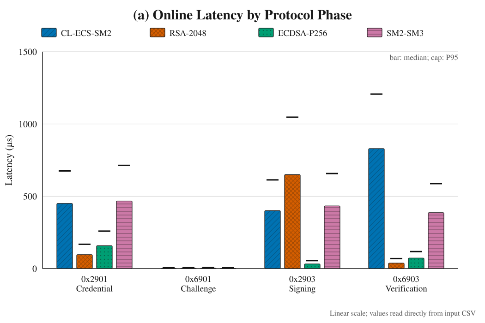
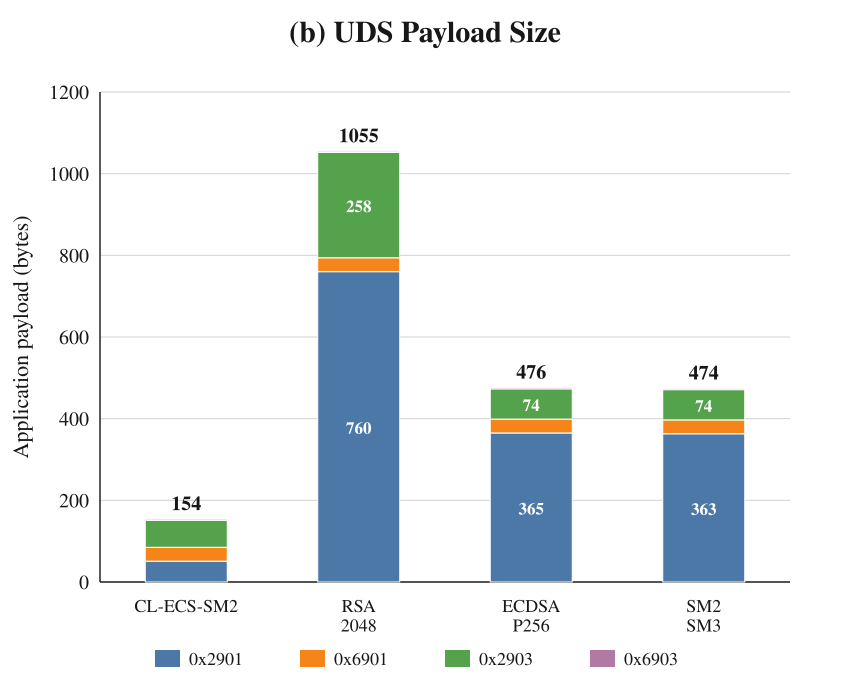
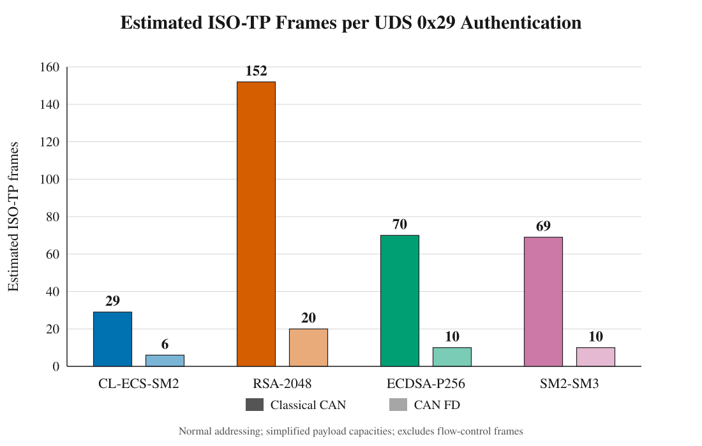
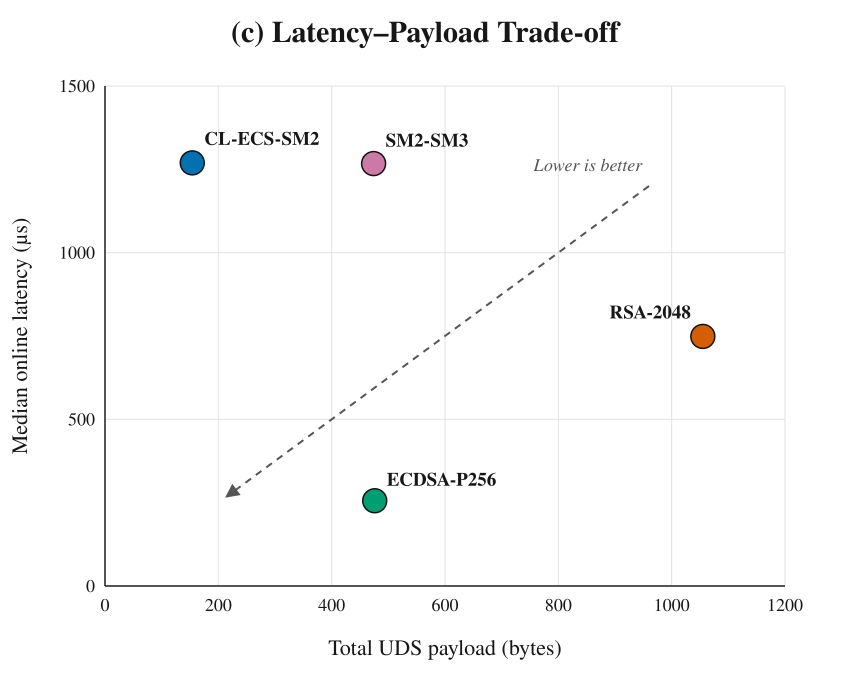

# CL-ECS-SM2 主方案实验报告

> 测试设备：`root@C202605211665597`
> 数据目录：`root-c202605211665597-linux-x86_64`
> 测试时间：2026-08-19（UTC）

## 1. 实验目标与方案定位

本实验的研究对象是面向 UDS 0x29 认证流程的 **CL-ECS-SM2 无证书方案**。报告重点回答两个问题：

1. CL-ECS-SM2 能否通过取消在线 X.509 证书传输，降低认证报文和 CAN/ISO-TP 分片开销；
2. 该通信收益需要付出多少在线密码计算代价，以及当前实现的主要优化方向是什么。

`SM2-SM3+X509`、`RSA-2048-PSS+X509` 和 `ECDSA-P256+X509` 仅作为参考方案，用于给 CL-ECS-SM2 的计算与通信开销提供量级基准，不作为本文的候选主方案或总体排名依据。

## 2. 测试环境与数据来源

| 项目 | 本次测试配置 |
|---|---|
| 主机 / 用户 | `C202605211665597` / `root` |
| 平台 | KVM 虚拟机，Red Hat KVM / i440FX |
| 操作系统 | Ubuntu 24.04.4 LTS，Linux 6.8.0-137-generic，x86_64 |
| CPU | Intel Xeon Platinum 8272CL @ 2.60 GHz，2 个 vCPU |
| 内存 | 2,063,204,352 B（约 1.92 GiB），标称 2 GB |
| 编译器 | GCC 13.3.0；基准程序 `-O2`；Tongsuo `-O3` |
| 密码库 | Tongsuo 8.5.0-pre2，OpenSSL 3.5.4，glibc 2.39 |
| 版本 | 结果提交 `58ab80b`；测试源码提交 `c5d1c8a`；Tongsuo 提交 `540603a3f` |
| 测试轮次 | 预热 1,000 轮，正式测试 10,000 轮 |
| CPU 绑定 | 未绑定 |
| 功能测试 | 四种方案正向认证全部通过；篡改 challenge 全部被拒绝 |

原始数据见 [`results.csv`](results/root-c202605211665597-linux-x86_64/results.csv)，完整设备信息见 [`metadata.json`](results/root-c202605211665597-linux-x86_64/metadata.json)。本次测试在虚拟机中运行，来宾系统无法读取 CPU 当前频率、频率范围和内存条频率；这些字段在 metadata 中明确记录为不可用。由于 CPU 未绑定且虚拟化调度可能产生长尾，正文以中位数作为主要指标，P95 用于观察常见尾延迟。

密钥生成、KGC 部分私钥提取和参考方案的证书签发不计入在线阶段。三种参考方案在每次会话中解析 DER 叶证书、验证单级证书链、检查证书 CN 与 UUID，并验证 `UUID || challenge` 的签名。

## 3. CL-ECS-SM2 主方案结果

### 3.1 在线计算延迟

单位为微秒（μs）。

| CL-ECS-SM2 阶段 | 均值 | 中位数 | P95 | 阶段中位数和内占比 |
|---|---:|---:|---:|---:|
| 0x2901 凭据处理 | 480.080 | 450.369 | 675.186 | 26.78% |
| 0x6901 challenge | 1.668 | 1.053 | 5.090 | 0.06% |
| 0x2903 签名 | 427.388 | 400.753 | 613.285 | 23.83% |
| 0x6903 验签 | 884.919 | 829.754 | 1,206.590 | 49.33% |
| **四阶段合计** | **1,794.056** | **1,693.511** | **2,345.730** | **100.00%** |

占比按四个阶段的中位数之和归一。各阶段分别独立统计，因此阶段中位数之和不要求严格等于逐轮总耗时的中位数。按总耗时统计，CL-ECS-SM2 的在线认证中位数为 **1.694 ms**，P95 为 **2.346 ms**，P95/中位数约为 1.39。

当前实现的主要计算瓶颈是 0x6903 验签：其耗时约占总中位数的 49%，其次是 0x2901 凭据处理。challenge 生成只占约 0.06%，对总耗时基本没有影响。因此后续性能优化应优先针对组合公钥验证方程、椭圆曲线标量乘和可安全缓存的中间量，而不是 challenge 路径。

### 3.2 与参考方案的计算对照

下表仍以每轮完整在线流程的中位数为主。参考方案用于说明 CL-ECS-SM2 的相对计算代价。

| 方案定位 | 方案 | 总耗时中位数 | P95 | CL-ECS-SM2 相对该方案 |
|---|---|---:|---:|---:|
| **主方案** | **CL-ECS-SM2** | **1,693.511** | **2,345.730** | — |
| 参考 | SM2-SM3+X509 | 1,296.035 | 1,834.430 | 慢 30.7% |
| 参考 | RSA-2048-PSS+X509 | 790.416 | 1,237.257 | 慢 114.3% |
| 参考 | ECDSA-P256+X509 | 269.868 | 428.818 | 慢 527.5% |

这组数据说明，**CL-ECS-SM2 的核心优势不是当前软件实现下的纯计算速度**。与国密参考方案 SM2+X.509 相比，ECS 的 0x2903 签名中位数为 400.753 μs，比 SM2 的 433.178 μs 快约 7.5%；它也比 RSA-PSS 的 650.032 μs 快约 38.3%。但是，ECS 的 0x6903 验签为 829.754 μs，是 SM2 验签的 2.15 倍，并由此拉高了完整流程时间。ECDSA-P256 使用成熟的专用优化路径，不能简单视为自定义 ECS 曲线代码在相同优化程度下的结果。

参考方案的意义在于界定优化目标：若希望 ECS 在保持通信优势的同时接近 SM2 证书方案的在线延迟，应首先降低验签路径约 443 μs 的差距，而不是改变协议的低成本 challenge 阶段。

## 4. CL-ECS-SM2 的主要优势：通信开销

字节数包含 UDS SID、子功能和结果字段，不包含 ISO-TP/CAN 帧头。本轮 ECDSA 和 SM2 的 DER 签名最大长度均为 72 B。

| 方案定位 | 方案 | 0x2901 | 0x6901 | 0x2903 | 0x6903 | 合计 |
|---|---|---:|---:|---:|---:|---:|
| **主方案** | **CL-ECS-SM2** | **84** | **34** | **67** | **3** | **188 B** |
| 参考 | SM2-SM3+X509 | 363 | 34 | 74 | 3 | 474 B |
| 参考 | ECDSA-P256+X509 | 364 | 34 | 74 | 3 | 475 B |
| 参考 | RSA-2048-PSS+X509 | 760 | 34 | 258 | 3 | 1,055 B |

CL-ECS-SM2 不在线传输 X.509 证书，完整认证只需 **188 B**。相对于参考方案，它减少：

- 相比 SM2-SM3+X509：减少 286 B，即 **60.3%**；
- 相比 ECDSA-P256+X509：减少 287 B，即 **60.4%**；
- 相比 RSA-2048-PSS+X509：减少 867 B，即 **82.2%**。

ECS 的签名采用固定 65 B 编码，报文长度稳定；X.509 证书和 DER 编码的 ECC 签名可能随生成结果发生 1–2 B 波动。对于需要预先分配诊断缓冲区、估算总线占用或限制多帧报文的 ECU，固定且较短的报文更容易进行资源规划。

按本项目普通寻址模型估算，CL-ECS-SM2 需要约 29 个经典 CAN 帧或 6 个 CAN FD 帧；SM2/ECDSA 参考方案约为 70/10 帧，RSA 参考方案约为 152/20 帧。相较 SM2 参考方案，ECS 可少用约 41 个经典 CAN 帧；这一收益尚未计入流控等待、仲裁竞争和重传，因此真实繁忙总线上的端到端收益需要实车或总线仿真实验进一步确认。

## 5. 计算—通信权衡

本次结果体现出 CL-ECS-SM2 的明确权衡：

- **通信侧**：188 B 的总负载显著小于所有证书参考方案，并避免每次认证传输叶证书；这是当前结果中最稳定、最直接的主方案优势。
- **计算侧**：当前 ECS 实现的在线认证中位数为 1.694 ms，慢于三个成熟库参考路径，其中组合公钥验签是首要瓶颈。
- **系统侧**：减少证书传输也意味着可减少在线证书解析、证书缓存和证书链装载，但“无证书”并不等于没有密钥生命周期管理；KGC 信任、部分私钥安全分发、撤销与设备换绑仍需由完整系统设计处理。
- **工程选择**：在经典 CAN 带宽紧张、诊断并发较高或希望减少证书分发负担时，ECS 的 60%–82% 负载下降具有实际价值；在计算资源极紧张且总线开销不构成约束时，当前实现仍需要优化后再评估部署。

## 6. 结果适用范围与局限

1. 延迟是主机上的密码流程时间，不包含真实 CAN 收发、ISO-TP 流控、仲裁等待、诊断会话切换和网络往返时间；不能把 1.694 ms 直接当作 ECU 端到端认证时间。
2. 本机是仅有 2 个 vCPU 的 KVM 虚拟机，CPU 未绑定且无法读取动态主频。结果适合该提交下的方案相对比较，不宜直接外推到带密码加速器的目标 ECU。
3. 参考方案调用了 Tongsuo/OpenSSL 中成熟的 RSA、P-256 和 SM2 路径，而 ECS 是自定义组合公钥运算；两者的实现成熟度不同。本文报告的是当前实现性能，不是算法理论下限。
4. 本实验采用单级叶证书和固定 32 B challenge。更长证书链、硬件安全模块、不同 MTU、扩展寻址或更复杂的撤销检查都会改变绝对结果。
5. 当前报告验证了正向流程与 challenge 篡改拒绝，但完整安全结论仍需要协议证明、密钥泄露模型、重放防护、KGC 威胁和侧信道评估。

## 7. 结论

在 `root@C202605211665597` 的本轮 10,000 次测试中，CL-ECS-SM2 主方案完成一次在线认证的中位数为 **1.694 ms**、P95 为 **2.346 ms**，通信负载为 **188 B**。与 SM2、ECDSA 和 RSA 证书参考方案相比，ECS 分别减少约 **60.3%**、**60.4%** 和 **82.2%** 的认证负载，说明取消在线证书传输能够显著降低 UDS/ISO-TP 通信开销。

与此同时，当前 ECS 软件实现并未取得计算速度优势：其完整流程比最接近的国密参考方案 SM2+X.509 慢约 **30.7%**，主要原因是 0x6903 组合公钥验签。因而论文应将结论表述为：**CL-ECS-SM2 以额外的椭圆曲线计算换取更小且固定的报文、较低的总线分片开销以及更简化的在线证书处理；后续工程优化的重点是验签路径。** 这一表述既突出 ECS 作为主方案的设计目标，也避免把参考算法在特定库和虚拟机上的速度误写成对 ECS 协议价值的否定。
